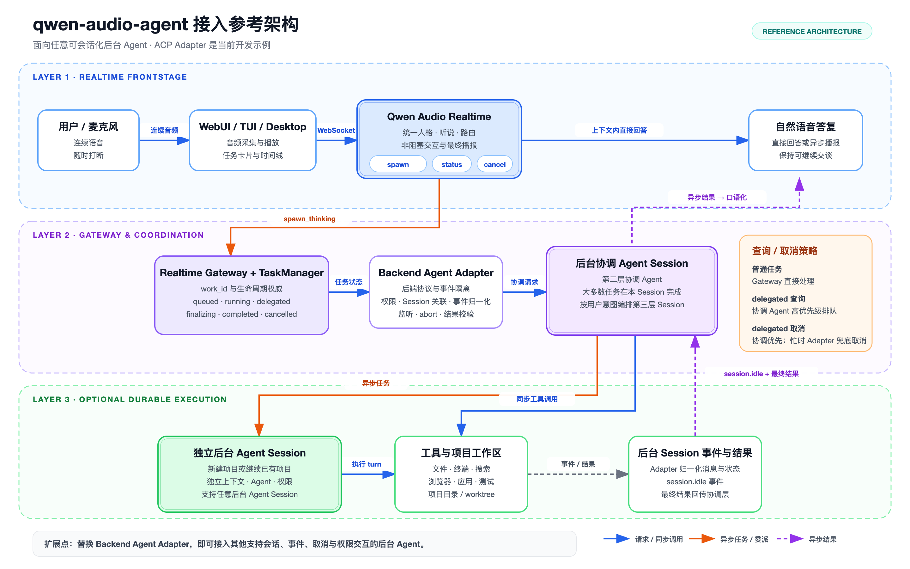

<!-- _class: lead -->

# 面向持续对话与长时任务的语音 Agent 架构

## qwen-audio-agent 架构设计

低延迟对话 · 异步工作 · 独立执行 · 自然播报 · 长期记忆

---

<!-- _class: diagram -->

# 系统总览：实时语音与后台 Agent 协同


<!--
[Sources]
- docs/architecture-overview.png
-->

---

# 框架目标：统一实时交互与长时任务执行

> 系统向用户呈现为一个持续在线的语音 Agent：前台保持对话，后台承担长时工作。

- 可即时响应的问题：直接回答，并支持随时打断。
- 复杂任务：交给后台，可能运行几分钟甚至更久。
- 等待期间：用户可以继续说话、查询进度或取消任务。
- 任务完成：结果回到同一个语音人格，自然地接上当前对话。

<p class="callout">核心目标：让“实时交谈”和“长期工作”同时成立。</p>

---

# 一个助手，运行在两种时间尺度上

<div class="two-col">

<div>

<p class="big-number">百毫秒级</p>

### 对话节奏

- 低延迟
- 可打断
- 持续在场

<p class="plain-term">实时路径目标：低延迟响应。</p>

</div>

<div>

<p class="big-number">秒~小时级</p>

### 工作节奏

- 工具与文件
- 多个工作会话
- 可恢复、可取消

<p class="plain-term">异步路径目标：可靠执行与恢复。</p>

</div>

</div>

---

<!-- _class: diagram -->

# 两级运行架构：实时前台与后台协调


<!--
[Sources]
- docs/qwen-audio-agent-two-layer-architecture.png
-->

---

# 两级架构划分为六个职责域

| 职责域 | 组件 | 架构职责 |
| --- | --- | --- |
| 实时对话 | Realtime Frontstage | 理解对话、决定直接回答或提交异步任务，承接后台结果 |
| 语音控制 | Realtime Gateway | 管理语音连接、回合、打断、Realtime 协议、响应关联与播放状态 |
| 任务账本 | TaskManager | 记录任务是否排队、运行、完成或取消 |
| 协议适配 | Backend Adapter | 将不同后台 Agent 归一为统一事件与状态 |
| 持续协调 | Coordinator Session | 维持用户上下文，决定直接完成或继续委派 |
| 结果播报 | AnnouncementManager | 等到合适时机，再让前台自然说出结果 |

**具体实现可以替换，职责边界必须保持稳定。**

---

# 一次后台任务经历判断、受理、执行与交付

<div class="runtime-pipeline">
  <div class="runtime-step">
    <strong>前台判断</strong>
    <span class="component">Realtime Frontstage</span>
    <span class="action">直接回答或转入后台</span>
  </div>
  <div class="runtime-arrow">→</div>
  <div class="runtime-step">
    <strong>任务受理</strong>
    <span class="component">TaskManager</span>
    <span class="action">建立任务并持续跟踪</span>
  </div>
  <div class="runtime-arrow">→</div>
  <div class="runtime-step">
    <strong>后台执行</strong>
    <span class="component">Backend Adapter<br>+ Coordinator Session</span>
    <span class="action">协调并持续处理</span>
  </div>
  <div class="runtime-arrow">→</div>
  <div class="runtime-step">
    <strong>结果交付</strong>
    <span class="component">AnnouncementManager</span>
    <span class="action">择机交给前台播报</span>
  </div>
</div>

> <strong>Gateway 服务统一承载并编排任务链路：</strong> Realtime Gateway 维护语音交互状态；TaskManager、后台协调器与 AnnouncementManager 分别负责受理、执行和交付。

---

# 实时前台只保留低延迟职责

<div class="two-col">

<div>

## 直接回答

- 当前上下文已经足够
- 不需要外部搜索或文件
- 在当前语音回合生成答案
- 用户可以随时打断

</div>

<div>

## 提交后台

- 需要搜索、工具或文件
- 通过 `spawn_thinking` 提交异步 Work
- 得到任务编号后结束本轮
- 后台独立继续执行

</div>

</div>

> 前台不持有后台原生 Session，也不决定后台工具链。

---

# 工具白名单，让前台能力保持可控

```js
export const TOOLS = [
  spawnThinkingTool,          // spawn_thinking：提交异步任务
  scheduleReminderTool,       // schedule_reminder：创建提醒或定时任务
  cancelAgentTaskTool,        // cancel_agent_task：取消后台任务
  getAgentTaskStatusTool,     // get_agent_task_status：查询状态与结果
  getCurrentTimeTool,         // get_current_time：获取用户本地时间
  memoryTool,                 // memory：读写长期记忆
  notesTool,                  // notes：管理命名清单
  respondAgentPermissionTool, // respond_agent_permission：回答权限请求
]
```

> <strong>前台工具集保持最小且有界：</strong> 复杂执行能力统一下沉后台，确保实时回合的低延迟与可预测性。

- 这些工具要么很快，要么只负责“提交和查询”。
- 前台没有创建后台 Session、选择子 Agent 或选择执行模式的工具。
- 工具越少，实时回合越可预测，也越容易保证安全。

<!--
[Sources]
- server/src/voice/frontend-tools.mjs
-->

---

# `spawn_thinking` ：快速受理，不等待结果

> **`spawn_thinking`** 是实时前台提交异步 Work 的唯一入口：Gateway 返回 `work_id` 后立即结束当前工具回合，后台任务继续独立执行。

| 步骤 | 系统做什么 | 用户得到什么 |
| ---: | --- | --- |
| 1 | 保留目标和约束 | 请求不会被改写成另一件事 |
| 2 | 检查后台是否已配置、权限是否待处理 | 明确失败原因，不假装成功 |
| 3 | 写入一个权威任务记录 | 产生唯一 `work_id` |
| 4 | 立即返回受理回执 | 可以继续下一轮对话 |
| 5 | 后台独立取得调度槽并执行 | 不占用实时语音回合 |

```text
accepted 只表示“任务已经进入系统”
不表示“任务已经完成”
```


---

# 协调信封承载前后台之间的任务交接

前台会同时传递两份信息：

| 字段 | 含义 | 为什么需要 |
| --- | --- | --- |
| `final_asr` | 用户本轮最终原话 | 它是事实来源，避免转述丢失细节 |
| `objective` | 前台整理后的执行目标 | 让后台快速理解目标与约束 |

示例：

```text
final_asr: “接着刚才那个页面，把登录失败的问题修掉，不要修改现有视觉。”

objective: “继续当前页面工作，修复登录失败问题；保持现有视觉不变。”
```

**整理目标帮助理解，但永远不覆盖用户原话。**

---

# 协调信封将对话请求转化为结构化协议

```json
{
  "protocol": "qwen-audio-agent.coordination.v1",
  "request_id": "work_...",
  "owner_scope": "current_authenticated_user",
  "voice_session_id": "...",
  "turn_id": "...",
  "input": {
    "final_asr": "用户本轮原话",
    "objective": "前台整理后的目标"
  },
  "client_context": {
    "working_directory": "..."
  }
}
```

信封把身份、任务、对话和工作目录分开表达，后台不必从一段长 Prompt 中猜测这些信息。

<!--
[Sources]
- server/src/agent/coordinator.mjs
-->

---

# TaskManager 维护 Work 生命周期的权威事实

每个任务都保存：

- **任务归属**：用户身份、语音 Session、来源回合。
- **要做什么**：objective。
- **做到哪一步**：状态、开始时间、完成时间。
- **发生过什么**：有界的工具活动和权限请求。
- **结果是什么**：最终结果或错误。
- **是否已经告诉用户**：通知状态和播放确认时间。

> 模型负责解释状态；TaskManager 决定状态是什么。

---

# Work 生命周期由显式状态机驱动

```text
scheduled
   │ 到时
   ▼
queued → running ─────────────────────────→ completed
            │                                  │
            ├→ delegated → finalizing ─────────┘
            │
            ├→ cancelling → cancelled
            │
            └──────────────────────────────→ failed
```

| 状态 | 运行语义 |
| --- | --- |
| `queued` | 已受理，正在等后台空闲 |
| `running` | 固定协调会话正在处理 |
| `delegated` | 独立工作会话正在执行 |
| `finalizing` | 工作已结束，正在整理最终结果 |
| `completed` | 可信结果已经产生 |

<!--
[Sources]
- server/src/task/task-manager.mjs
-->

---

# TaskManager 决定后台任务何时开始、是否并行

任务进入 `queued` 后，TaskManager 按以下规则决定何时开始执行：

<div class="three-col">

<div>

### 有界并发

限制同时运行的后台任务，避免本机资源和后台服务过载。

</div>

<div>

### 串行协调

同一协调 Session 一次只处理一项任务，保证上下文顺序。

</div>

<div>

### 委派释放

任务进入独立执行层后释放协调槽位，长任务不阻塞后续请求。

</div>

</div>

> <strong>核心约束：</strong> 资源可控、上下文有序、长任务不阻塞持续对话。

---

# 协调 Session 提供可持续续接的后台对话窗口

协调 Session 是 Backend Adapter 为当前用户创建或恢复的一条后台 Agent 原生会话，用于承接跨任务的持续理解与执行协调。

- 同一用户反复复用，而不是每次重新开始。
- 看到最近对话、长期记忆和当前任务状态。
- 简单后台工作可以自己完成。
- 复杂、独立或长期工作可以进入独立执行层。
- 独立任务完成后，它负责校验结果并整理最终表达。

```js
return `${protocol}:${encodeURIComponent(
  clean(ownerId) || 'personal'
)}:backend`
```

**协调会话负责持续理解；独立 Session 负责长任务执行。**

<!--
[Sources]
- server/src/agent/acp-backend-session-utils.mjs
- server/src/agent/acp-backend-adapter.mjs
-->

---

# Backend Adapter 统一不同后台的协议语义

Backend Adapter 是后台协议适配层：

| 不同后台的差异 | 对上层统一成 |
| --- | --- |
| 不同 Session 协议 | 创建、恢复、继续、取消 |
| 不同工具事件 | 搜索、读取、修改、执行等通用活动 |
| 不同权限格式 | 有界的权限问题和用户决定 |
| 不同完成事件 | 可信结果与统一错误 |
| 不同启动方式 | owned / external 的明确进程归属 |

这样更换后台 Agent 时，不需要重写前台工具、任务状态机和播报逻辑。

---

# 结果交付必须服从双工会话状态

结果产生时，用户可能正在说话或正在听上一段音频。

系统会依次：

1. 等用户说完。
2. 等当前回复与音频队列结束。
3. 等一个很短的安静窗口。
4. 合并刚刚一起完成的结果。
5. 把结果事实放回 Realtime 上下文。
6. 让同一人格自然表达。
7. 客户端开始播放后，才将通知标记为“已交付”。

> 最快说出来，不一定是最自然的交互。

---

# `response.done` 不是“用户已经听到”

```js
if (outcome?.completed) {
  // Realtime has generated the response, but the client may still have it
  // queued behind earlier audio. Delivery is confirmed only when the
  // client reports that playback has actually started.
  batch.responseCompleted = true
  this.scheduleAcknowledgementTimeout()
}
```

```text
任务完成
  ≠ 语音生成完成
  ≠ 客户端开始播放
```

- 生成完成后仍然保留“领取凭证”，防止结果丢失。
- 重连或播放失败时可以重试。
- 同一结果上下文只注入一次，避免模型反复看到重复事实。

<!--
[Sources]
- server/src/voice/announcement/announcement-manager.mjs
- server/src/voice/realtime-gateway.mjs
-->

---

# 独立执行层：扩展协调层的任务执行边界

协调 Session 单独创建或续接目标 Session；执行 Session 独立持有对话历史、工作目录、工具与权限，并以结构化事件返回状态和结果。

<div class="two-col">

<div>

## 独立执行边界

- Session 保存任务历史与执行进度
- 工作区承载文件、工具和产物
- 权限约束在当前任务范围

</div>

<div>

## 与协调层形成闭环

1. 创建或续接目标 Session
2. 执行期间持续回传事件
3. 查询、取消与恢复指向同一 Session
4. 最终结果返回协调层统一交付

</div>

</div>

**核心价值：任务拥有独立、可追踪、可取消、可续接的生命周期。**

---

<!-- _class: diagram-only -->
<!-- _footer: "" -->
<!-- _paginate: false -->



<!--
[Sources]
- docs/qwen-audio-agent-three-layer-architecture.png
-->

---

# 是否进入独立执行层，取决于任务是否需要独立生命周期

<div class="two-col">

<div>

## 进入独立执行层

- 需要跨回合延续同一个工作 Session
- 需要独立工作区和多步工具执行
- 需要单独的权限、取消或恢复边界
- 用户明确继续已有项目 Session

</div>

<div>

## 留在协调 Session

- 当前协调回合即可完成
- 只需轻量检索、计算或状态查询
- 回合结束后无需保留执行状态
- 结果可以直接进入交付

</div>

</div>

**判断标准不是任务“难不难”，而是是否需要创建并维护独立执行状态。**

---

# 五个 MCP Session 工具连接协调层与独立执行层

```js
export const ACP_SESSION_TOOL_NAMES = [
  'qwen_audio_agent_sessions_list',
  'qwen_audio_agent_session_start',
  'qwen_audio_agent_session_send',
  'qwen_audio_agent_session_status',
  'qwen_audio_agent_session_cancel',
]
```

| 工具 | 职责 |
| --- | --- |
| `list` | 找到以前的工作 Session |
| `start` | 开始一项新的独立工作 |
| `send` | 继续某个已有 Session |
| `status` | 读取当前执行状态与阶段结果 |
| `cancel` | 精确取消这项工作 |

MCP Session 工具不暴露给语音前台，仅作为协调会话管理独立执行层的统一接口。

<!--
[Sources]
- server/src/agent/acp-session-tools.mjs
-->

---

# 委派是一套可追踪、可取消、可恢复的执行协议

| 阶段 | 谁负责 | 关键动作 |
| ---: | --- | --- |
| 1 | 协调会话 | 调用 `session_start` 或 `session_send` |
| 2 | Adapter | 记录 delegation ID 与目标 Session |
| 3 | TaskManager | Work 进入 `delegated`，释放协调槽位 |
| 4 | 独立 Session | 使用文件、终端、搜索等能力长期执行 |
| 5 | Adapter | 等待与当前委派精确匹配的最终结果 |
| 6 | 协调会话 | 重新取得控制权，校验并整理结果 |
| 7 | TaskManager | Work 进入 `completed`，等待自然播报 |

取消、查询、权限和重启恢复，始终绑定同一个 Work 与目标 Session。

---

# 记忆架构：双路径写入与统一上下文消费

<div class="memory-arch">

<div class="memory-stack">
  <div class="memory-node"><strong>显式写入</strong>Realtime <code>memory</code> tool</div>
  <div class="memory-node"><strong>会后整理</strong>MemoryExtractor</div>
</div>

<div class="memory-arrow">›</div>

<div class="memory-node memory-service"><strong>统一记忆服务</strong>边界校验 · revision 校验<br>原子写入 · 审计</div>

<div class="memory-arrow">›</div>

<div class="memory-stack">
  <div class="memory-node memory-store"><strong>USER.md</strong>长期交互偏好</div>
  <div class="memory-node memory-store"><strong>MEMORY.md</strong>长期事实数据</div>
</div>

<div class="memory-arrow">›</div>

<div class="memory-stack">
  <div class="memory-node memory-consumer"><strong>Realtime Frontstage</strong>直接对话与工具判断</div>
  <div class="memory-node memory-consumer"><strong>Coordinator Session</strong>后台理解与结果校验</div>
</div>

</div>

<p class="small">PROMPT.md 与 ASSISTANT.md 是只读运行时设定，不属于记忆；它们与 USER.md、MEMORY.md 一起参与上下文构建。</p>

<!--
[Sources]
- server/src/conversation/frontend-agent-context.mjs
- server/src/conversation/frontend-memory-service.mjs
- server/src/conversation/memory-extractor.mjs
-->

---

# 运行时上下文由系统设定与长期信息共同构成

| 上下文来源 | 作用 | 类型与权威 |
| --- | --- | --- |
| `PROMPT.md` | 核心协议、工具规则与安全边界 | 系统设定，只读，最高优先级 |
| `ASSISTANT.md` | 默认身份、人格与关系定位 | 系统设定，只读，作为默认值 |
| 当前请求 | 用户此刻明确表达的目标 | 当前回合意图，高于历史偏好 |
| `USER.md` | 称呼、语言、表达风格与默认做法 | 可写记忆，具有有限指令权威 |
| `MEMORY.md` | 稳定事实、项目背景与长期决定 | 可写记忆，只作为理解数据 |

**记忆存储仅包括 USER.md 与 MEMORY.md。**

指令优先级：PROMPT &gt; 当前请求 &gt; USER &gt; ASSISTANT；MEMORY 只作为理解数据，不参与指令竞争。

---

# 长期信息通过显式记忆与会后整理两种入口写入

<div class="two-col">

<div>

## 用户明确要求记住

- 由当前语音回合显式触发
- `read`：查看已有内容
- `append`：追加一项
- `replace`：精确修改或删除
- 写入成功后才能说“记住了”

</div>

<div>

## 会话结束后自动整理

- 由语音 Session 关闭异步触发
- MemoryExtractor 提议最小修改
- 只处理 `USER.md` 与 `MEMORY.md`
- 静默运行，不阻塞会话关闭

</div>

</div>

**两个入口最终调用同一个 FrontendMemoryService；模型和工具都不能直接改写 Markdown 文件。**

---

# 自动整理采用“模型建议、代码裁决”的提交协议

```text
对话转写 → 模型生成 JSON Patch
         → 敏感信息与文档边界校验
         → USER 明确指令校验
         → revision 校验与原子写入
         → 审计
```

- `USER.md` 只接收能在用户原话中确认的长期交互指令。
- `MEMORY.md` 只接收稳定、具有跨会话价值的事实，并拒绝指令形态内容。
- 密码、密钥、验证码、token、证件和健康信息不会写入。
- 任何失败都静默结束，不修改 `ASSISTANT.md`，也不阻塞 Session 关闭。

**默认运行门槛：至少 4 条用户消息 · 同一用户冷却 30 分钟 · 最多读取最近 6000 字符转写。**

<!--
[Sources]
- server/src/conversation/memory-extractor.mjs
- server/src/conversation/frontend-memory-service.mjs
-->

---

# ConversationSync：恢复前台上下文并避免重复播报

ConversationSync 是 Gateway 内的短期会话账本，记录用户说了什么、前台答了什么、后台返回了什么，以及结果是否已经向用户表达。

<div class="two-col">

<div>

## 记录四类内容

| 时间线来源 | 内容 |
| --- | --- |
| `voice-user` | 用户最终转写 |
| `realtime-direct` | 前台直接回答 |
| `agent-result` | 后台原始结果 |
| `agent-presentation` | 已向用户表达的结果 |

</div>

<div>

## 直接解决三个问题

- **连接重建**：把最近对话重新交给 Realtime Frontstage
- **结果交付**：判断后台结果是否已经说过，避免重复注入或播报
- **记忆整理**：会话结束后向 MemoryExtractor 提供完整转写

</div>

</div>

**边界：它不共享后台 Agent 的内部 Session，也不保存跨会话长期记忆。**

---

# 跨模块协作依赖职责边界与时序控制

单个组件可以替换；组件之间对系统事实、权限归属和状态生效时机的约定必须保持稳定。

<div class="two-col compact">

<div>

### 职责边界

- 前台工具越少，实时路径越稳定
- Gateway 管事实，模型管表达
- 协调会话和执行 Session 分开
- 事实记忆和行为偏好分开
- 权限绑定用户身份与 Session

</div>

<div>

### 时序控制

- receipt 不等待后台完成
- transcript 关联不阻塞回执
- 委派后立即释放协调槽
- 结果等到自然窗口再播报
- 播放开始才确认交付

</div>

</div>

> 架构优化目标不是局部最短延迟，而是端到端的连续对话、可控执行与可靠恢复。

---

# 架构演进必须守住六条不变量

1. Realtime Frontstage 只做低延迟判断与路由，不演变为多步后台 Agent。
2. Work 状态由 TaskManager 维护，不能由模型文本代替。
3. 结果交付由客户端播放状态确认，不能用 `response.done` 代替。
4. 独立执行开始后释放协调槽，不持续占用协调 Session。
5. `USER.md` 与 `MEMORY.md` 的指令、数据边界不能混淆。
6. 重连或工具重试不能创建重复 Work；同一结果只能由一个语音连接交付。

<p class="callout">这些不变量约束跨模块契约；组件实现和后台类型可以替换。</p>

---

# 总结：七项架构设计原则

1. **用异步协议连接不同时间尺度。**
2. **Gateway 管系统事实，模型管理解与表达。**
3. **协调 Session 维持连续性，独立 Session 承担长任务执行。**
4. **后台任务完成不等于结果已交付，交付需要独立调度与确认。**
5. **记忆按权威分层，个性化不能突破安全边界。**
6. **跨会话能力必须可查询、可取消、可恢复、可审计。**
7. **局部失败不能让主对话失去可用性。**

> 最终目标：让用户感知到一个持续在线、可靠做事、自然交付结果的语音助手。
